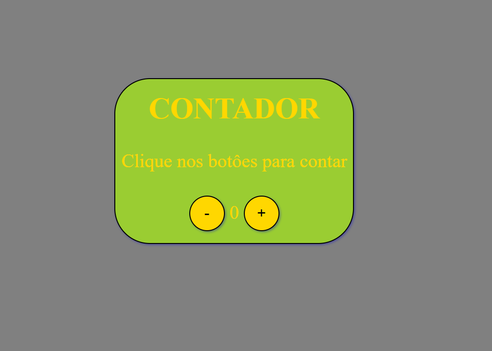

# Projeto "Criando um contador" - DIO

## 📚 Descrição

- No projeto tentei implementar os eventos usando o método "addEventListener". 
- Também tentei criar condicionais que desabilitam o botão de incrementar ou decrementar quando o contador chega a um determinado valor.
- Consegui realizar a alteração da cor do texto, quando o texto em currentNumber for um número negativo.

*Para ter acesso a este conteúdo, acesse a [**DIO**](https://web.digitalinnovation.one)*                                  

## 🚀 Tecnologias

O projeto foi desenvolvido a partir das tecnologias:

- *HTML5*
- *CSS3*
- *JS*

Developed by - [**Felipe Rodrigues**](https://github.com/Felpz28)
